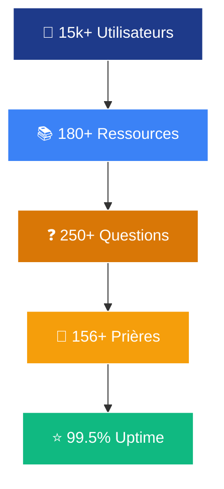
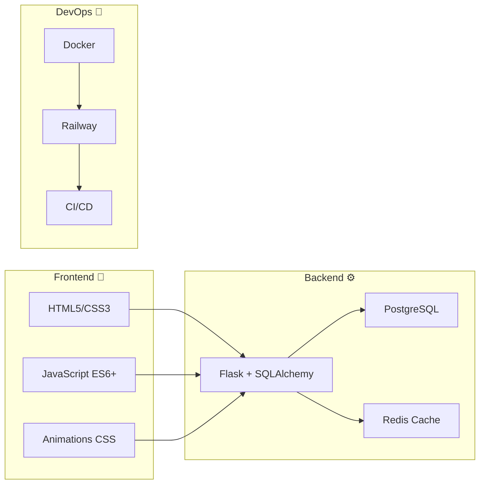
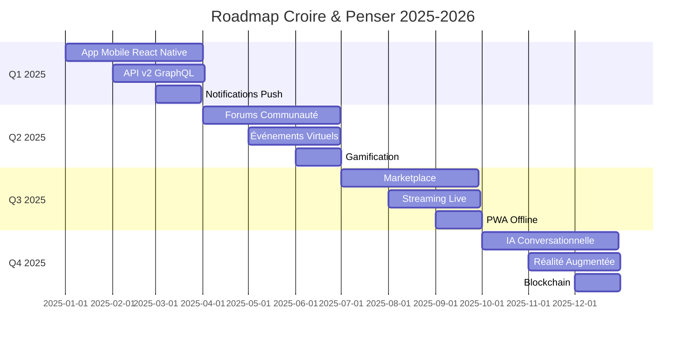

# ✨ Croire & Penser – Plateforme Foi & Raison

<div align="center">
  
  <p><strong>"Amener les croyants à penser, et les penseurs à croire"</strong></p>
  <p>Plateforme communautaire premium de 11 pages chorégraphiées qui marie excellence théologique, narration numérique et inclusivité WCAG 2.1.</p>
  <a href="https://github.com/cognito-inc/croire-et-penser"></a>
  <br />
  
  
  
</div>

---

## 🎬 Sommaire cinétique
- 🎯 Vision immersive
- 🚀 Expérience & piliers dynamiques
- 🧭 Parcours narratif des pages
- 🎨 Prévisualisations palette & typographie
- 🌀 Animations vedettes
- 🧱 Stack & opérations
- 🗺️ Roadmap 2025-2026
- 🤝 Support & communauté
- 🧾 Licence & crédits
- 📐 Design System intégral

## 🎯 Vision immersive

> « Une plateforme d'excellence dédiée à l'exploration intelligente de la foi chrétienne, où raison et spiritualité dialoguent en continu. »

### Objectifs stratégiques
- Stimuler la réflexion théologique, philosophique et éthique avec un ton académique accessible.
- Offrir des ressources premium orchestrées par un design system cohérent et animatif.
- Rassembler croyants, chercheurs et créatifs autour d'une communauté bienveillante.
- Éclairer les enjeux contemporains à la lumière de l'Évangile avec rigueur data-driven.

### Engagement communautaire
- 80+ contributeurs et mentors actifs dans les espaces collaboratifs.
- 250+ questions traitées via le module Q&R et enrichies par les modérateurs.
- 15k lecteurs bénéficient d'expériences guidées, méditations et masterclasses.

## 🚀 Expérience & piliers dynamiques

### Highlights produit
- 11 pages responsive, micro-interactives et documentées pour desktop, tablette et mobile.
- Système d'identité animé (couleurs, typos, composants) garantissant des transitions fluides.
- Accessibilité WCAG 2.1 AA, navigation clavier et focus visibles sur chaque module.
- Performances optimisées (lazy-loading, critical CSS, caching API) pour un ressenti premium.

### Indicateurs vivants
| Indicateur | Valeur |
| --- | --- |
| Pages immersives | 11 |
| Ressources thématiques |  |
| Prières communautaires |  |
| Questions modérées |  |
| SLA disponibilité | 99.5% |

### Modules phares
- **Laboratoire d'idées** : articles longs, annotations, citations animées.
- **Médiathèque** : audio, vidéos, lectures guidées avec particules contemplatives.
- **Mentorat & prières** : timelines spirituelles, formulaires multi-étapes, audio player.
- **Donation & partenariats** : parcours de confiance, graphiques de transparence et badges.

## 🧭 Parcours narratif des pages

Chaque écran est scénarisé comme un chapitre : storytelling spirituel, gradients vivants, CTA lumineux et contenu éditorial vérifié. Replongez dans la cartographie complète ci-dessous.

### 📱 Architecture des Pages

### **🏠 Pages Principales (9 pages)**

<details>
<summary><strong>1. 🏠 Accueil</strong> - <code>/</code></summary>

**Fonctionnalités:**
- **Hero Carousel** ultra-dynamique (3 slides)
- **Section Mission** avec cartes animées (4 piliers)
- **Ressources** avec effets hover sophistiqués
- **Statistiques** avec compteurs animés (250+ questions, 80 contributeurs, 15k lecteurs)
- **Newsletter** avec formulaire interactif
- **Verset biblique** avec typographie élégante (Ésaïe 55:8-9)

**Animations:**
- Particules flottantes en arrière-plan
- Carousel avec transitions fluides
- Cartes avec élévation 3D au survol
- Icônes rotatives et scintillantes
- Effets de brillance sur les boutons

</details>

<details>
<summary><strong>2. 📚 Contenus</strong> - <code>/contents</code></summary>

**Fonctionnalités:**
- **Filtres dynamiques** par catégorie (11 thèmes) et type
- **Grille responsive** avec animations de chargement
- **Modales détaillées** avec références bibliques
- **Système de likes** avec animations de cœur
- **Pagination** fluide et intuitive

**Catégories Thématiques:**
- Dieu (existence, nature, trinité)
- Bible (authenticité, interprétation)
- Jésus-Christ (historicité, divinité)
- Saint-Esprit (dons, miracles)
- Salut (foi, religions)
- Église (communauté, culte)
- Être humain (âme, éthique)
- Le mal (origine, souffrance)
- Monde invisible (anges, esprits)
- La fin (eschatologie, éternité)
- Éthique (morale, société)

</details>

<details>
<summary><strong>3. ❓ Questions & Réponses</strong> - <code>/qa</code></summary>

**Fonctionnalités:**
- **Interface FAQ** interactive avec recherche
- **Formulaire de soumission** avec validation temps réel
- **Système de recherche** instantané
- **Accordéons animés** pour les réponses
- **Catégorisation thématique** intelligente

**Animations:**
- Expansion fluide des réponses
- Highlighting des résultats de recherche
- Validation visuelle des formulaires

</details>

<details>
<summary><strong>4. 🙏 Prières</strong> - <code>/prayers</code></summary>

**Fonctionnalités:**
- **Méditations guidées** avec lecteur audio intégré
- **Prières communautaires** interactives
- **Versets quotidiens** avec animations d'apparition
- **Formulaire de demandes** spirituelles
- **Ambiance contemplative** avec design apaisant

**Éléments Spirituels:**
- Lecteur audio pour méditations
- Galerie de versets inspirants
- Formulaire de demandes de prière
- Témoignages de la communauté

</details>

<details>
<summary><strong>5. 📞 Contact</strong> - <code>/contact</code></summary>

**Fonctionnalités:**
- **Formulaire multi-étapes** avec validation avancée
- **Informations de contact** stylisées
- **FAQ intégrée** avec recherche instantanée
- **Réseaux sociaux** avec effets hover élégants

**Coordonnées:**
- Email: contact@croireetpenser.com
- Téléphone: +1 (438) 529-9073
- Adresse: 

</details>

<details>
<summary><strong>6. 💝 Donation</strong> - <code>/donation</code></summary>

**Fonctionnalités:**
- **Interface ultra-moderne** de paiement
- **Intégration PayPal/Stripe/Interac** sécurisée
- **Montants prédéfinis** avec animations de sélection
- **Témoignages** de donateurs avec carrousel
- **Transparence financière** avec graphiques

**Options de Don:**
- Montants: 25$, 50$, 100$, 250$, 500$, Personnalisé
- Récurrence: Unique, Mensuel, Annuel
- Méthodes: PayPal, Stripe, Interac e-Transfer

</details>

<details>
<summary><strong>7. 📅 Événements</strong> - <code>/events</code></summary>

**Fonctionnalités:**
- **Calendrier interactif** avec filtres par type
- **Cartes d'événements** avec animations d'apparition
- **Système d'inscription** intégré avec confirmation
- **Galerie photos/vidéos** des événements passés
- **Partage social** dynamique

**Types d'Événements:**
- Conférences théologiques
- Études bibliques
- Retraites spirituelles
- Débats académiques
- Rencontres communautaires

</details>

<details>
<summary><strong>8. 🤝 Partenariats</strong> - <code>/partnerships</code></summary>

**Fonctionnalités:**
- **Présentation des partenaires** avec logos animés
- **Formulaire de collaboration** professionnel
- **Témoignages** avec carrousel automatique
- **Opportunités** de partenariat détaillées
- **Processus** de candidature étape par étape

**Types de Partenariats:**
- Institutions académiques
- Églises locales
- Organisations chrétiennes
- Médias spirituels
- Éditeurs religieux

</details>

<details>
<summary><strong>9. ℹ️ À Propos</strong> - <code>/about</code></summary>

**Fonctionnalités:**
- **Histoire de la mission** avec timeline interactive
- **Équipe** avec profils animés et biographies
- **Valeurs** avec icônes interactives et descriptions
- **Vision** avec éléments visuels inspirants
- **Témoignages** de la communauté avec rotation

**Équipe Fondatrice:**
- Directeur spirituel
- Responsable académique
- Coordinateur communautaire
- Développeur technique

</details>

### **⚙️ Pages Administratives (2 pages)**

<details>
<summary><strong>10. ⚙️ Administration</strong> - <code>/admin</code></summary>

**Fonctionnalités:**
- **Dashboard** avec statistiques temps réel
- **Gestion des contenus** avec éditeur WYSIWYG
- **Modération** des questions et commentaires
- **Analytics** avec graphiques animés
- **Paramètres** système et configuration


</details>

<details>
<summary><strong>11. 📝 CMS</strong> - <code>/cms</code></summary>

**Fonctionnalités:**
- **Interface de gestion** complète et intuitive
- **Éditeur de contenu** professionnel avec prévisualisation
- **Gestion des utilisateurs** avec rôles et permissions
- **Système de médias** avec upload et organisation
- **Sauvegarde automatique** et versioning

**Modules CMS:**
- Gestion des articles
- Bibliothèque multimédia
- Utilisateurs et permissions
- Paramètres SEO
- Analytics intégrés

</details>

## 🎨 Prévisualisations palette & typographie par page

<table>
  <thead>
    <tr>
      <th>Page</th>
      <th>Palette active</th>
      <th>Typographies en scène</th>
    </tr>
  </thead>
  <tbody>
    <tr>
      <td><strong>🏠 Accueil Vision</strong><br><em>Hero immersif &amp; mission prophétique</em></td>
      <td>
        <div style="display:flex;gap:6px;align-items:center;">
          <span style="width:26px;height:26px;border-radius:6px;background:#1e3a8a;border:1px solid #e2e8f0;" title="#1e3a8a"></span>
          <span style="width:26px;height:26px;border-radius:6px;background:#3b82f6;border:1px solid #e2e8f0;" title="#3b82f6"></span>
          <span style="width:26px;height:26px;border-radius:6px;background:#d97706;border:1px solid #e2e8f0;" title="#d97706"></span>
        </div>
        <code>#1e3a8a · #3b82f6 · #d97706</code>
      </td>
      <td>
        <strong>Playfair Display 900</strong> – Titres héro<br>
        <em>Inter 600</em> – CTA animés<br>
        Source Sans Pro 400 – Narration inspirante
      </td>
    </tr>
    <tr>
      <td><strong>📚 Contenus</strong><br><em>Ressources théologiques</em></td>
      <td>
        <div style="display:flex;gap:6px;align-items:center;">
          <span style="width:26px;height:26px;border-radius:6px;background:#3b82f6;border:1px solid #e2e8f0;" title="#3b82f6"></span>
          <span style="width:26px;height:26px;border-radius:6px;background:#f59e0b;border:1px solid #e2e8f0;" title="#f59e0b"></span>
          <span style="width:26px;height:26px;border-radius:6px;background:#f8fafc;border:1px solid #e2e8f0;" title="#f8fafc"></span>
        </div>
        <code>#3b82f6 · #f59e0b · #f8fafc</code>
      </td>
      <td>
        <strong>Playfair Display 700</strong> – Titres de sections<br>
        <em>Inter 500</em> – Filtres et tags<br>
        Source Sans Pro 400 – Cartes de contenu
      </td>
    </tr>
    <tr>
      <td><strong>❓ Questions &amp; Réponses</strong><br><em>FAQ interactive</em></td>
      <td>
        <div style="display:flex;gap:6px;align-items:center;">
          <span style="width:26px;height:26px;border-radius:6px;background:#1e3a8a;border:1px solid #e2e8f0;" title="#1e3a8a"></span>
          <span style="width:26px;height:26px;border-radius:6px;background:#10b981;border:1px solid #e2e8f0;" title="#10b981"></span>
          <span style="width:26px;height:26px;border-radius:6px;background:#6b7280;border:1px solid #e2e8f0;" title="#6b7280"></span>
        </div>
        <code>#1e3a8a · #10b981 · #6b7280</code>
      </td>
      <td>
        <strong>Inter 600</strong> – Questions<br>
        <em>Playfair Display 600</em> – Versets clés<br>
        Source Sans Pro 400 – Réponses détaillées
      </td>
    </tr>
    <tr>
      <td><strong>🙏 Prières</strong><br><em>Méditations audio &amp; demandes</em></td>
      <td>
        <div style="display:flex;gap:6px;align-items:center;">
          <span style="width:26px;height:26px;border-radius:6px;background:#1e3a8a;border:1px solid #e2e8f0;" title="#1e3a8a"></span>
          <span style="width:26px;height:26px;border-radius:6px;background:#f8fafc;border:1px solid #e2e8f0;" title="#f8fafc"></span>
          <span style="width:26px;height:26px;border-radius:6px;background:#f59e0b;border:1px solid #e2e8f0;" title="#f59e0b"></span>
        </div>
        <code>#1e3a8a · #f8fafc · #f59e0b</code>
      </td>
      <td>
        <strong>Playfair Display 700</strong> – Liturgies<br>
        <em>Inter 400</em> – Formulaires<br>
        Source Sans Pro 300 – Méditations guidées
      </td>
    </tr>
    <tr>
      <td><strong>📞 Contact</strong><br><em>Multi-step &amp; FAQ instantanée</em></td>
      <td>
        <div style="display:flex;gap:6px;align-items:center;">
          <span style="width:26px;height:26px;border-radius:6px;background:#3b82f6;border:1px solid #e2e8f0;" title="#3b82f6"></span>
          <span style="width:26px;height:26px;border-radius:6px;background:#1e3a8a;border:1px solid #e2e8f0;" title="#1e3a8a"></span>
          <span style="width:26px;height:26px;border-radius:6px;background:#f8fafc;border:1px solid #e2e8f0;" title="#f8fafc"></span>
        </div>
        <code>#3b82f6 · #1e3a8a · #f8fafc</code>
      </td>
      <td>
        <strong>Inter 600</strong> – CTA de prise de contact<br>
        <em>Playfair Display 600</em> – Accents inspirants<br>
        Source Sans Pro 400 – Informations pratiques
      </td>
    </tr>
    <tr>
      <td><strong>💝 Donation</strong><br><em>Parcours de générosité</em></td>
      <td>
        <div style="display:flex;gap:6px;align-items:center;">
          <span style="width:26px;height:26px;border-radius:6px;background:#d97706;border:1px solid #e2e8f0;" title="#d97706"></span>
          <span style="width:26px;height:26px;border-radius:6px;background:#f59e0b;border:1px solid #e2e8f0;" title="#f59e0b"></span>
          <span style="width:26px;height:26px;border-radius:6px;background:#10b981;border:1px solid #e2e8f0;" title="#10b981"></span>
        </div>
        <code>#d97706 · #f59e0b · #10b981</code>
      </td>
      <td>
        <strong>Playfair Display 700</strong> – Impact stories<br>
        <em>Inter 600</em> – Montants &amp; switches<br>
        Source Sans Pro 400 – Transparence financière
      </td>
    </tr>
    <tr>
      <td><strong>📅 Événements</strong><br><em>Calendrier interactif</em></td>
      <td>
        <div style="display:flex;gap:6px;align-items:center;">
          <span style="width:26px;height:26px;border-radius:6px;background:#3b82f6;border:1px solid #e2e8f0;" title="#3b82f6"></span>
          <span style="width:26px;height:26px;border-radius:6px;background:#f59e0b;border:1px solid #e2e8f0;" title="#f59e0b"></span>
          <span style="width:26px;height:26px;border-radius:6px;background:#6b7280;border:1px solid #e2e8f0;" title="#6b7280"></span>
        </div>
        <code>#3b82f6 · #f59e0b · #6b7280</code>
      </td>
      <td>
        <strong>Playfair Display 700</strong> – Titres d'événements<br>
        <em>Inter 500</em> – Filtres &amp; badges<br>
        Source Sans Pro 400 – Descriptions
      </td>
    </tr>
    <tr>
      <td><strong>🤝 Partenariats</strong><br><em>Opportunités &amp; logos animés</em></td>
      <td>
        <div style="display:flex;gap:6px;align-items:center;">
          <span style="width:26px;height:26px;border-radius:6px;background:#1e3a8a;border:1px solid #e2e8f0;" title="#1e3a8a"></span>
          <span style="width:26px;height:26px;border-radius:6px;background:#d97706;border:1px solid #e2e8f0;" title="#d97706"></span>
          <span style="width:26px;height:26px;border-radius:6px;background:#f8fafc;border:1px solid #e2e8f0;" title="#f8fafc"></span>
        </div>
        <code>#1e3a8a · #d97706 · #f8fafc</code>
      </td>
      <td>
        <strong>Playfair Display 700</strong> – Récits de partenaires<br>
        <em>Inter 500</em> – Formulaires<br>
        Source Sans Pro 400 – Processus &amp; KPIs
      </td>
    </tr>
    <tr>
      <td><strong>ℹ️ À Propos</strong><br><em>Timeline &amp; valeurs</em></td>
      <td>
        <div style="display:flex;gap:6px;align-items:center;">
          <span style="width:26px;height:26px;border-radius:6px;background:#3b82f6;border:1px solid #e2e8f0;" title="#3b82f6"></span>
          <span style="width:26px;height:26px;border-radius:6px;background:#6b7280;border:1px solid #e2e8f0;" title="#6b7280"></span>
          <span style="width:26px;height:26px;border-radius:6px;background:#f8fafc;border:1px solid #e2e8f0;" title="#f8fafc"></span>
        </div>
        <code>#3b82f6 · #6b7280 · #f8fafc</code>
      </td>
      <td>
        <strong>Playfair Display 700</strong> – Citations<br>
        <em>Inter 400</em> – Timeline<br>
        Source Sans Pro 400 – Biographies
      </td>
    </tr>
    <tr>
      <td><strong>⚙️ Administration</strong><br><em>Dashboard &amp; analytics</em></td>
      <td>
        <div style="display:flex;gap:6px;align-items:center;">
          <span style="width:26px;height:26px;border-radius:6px;background:#1e3a8a;border:1px solid #e2e8f0;" title="#1e3a8a"></span>
          <span style="width:26px;height:26px;border-radius:6px;background:#6b7280;border:1px solid #e2e8f0;" title="#6b7280"></span>
          <span style="width:26px;height:26px;border-radius:6px;background:#10b981;border:1px solid #e2e8f0;" title="#10b981"></span>
        </div>
        <code>#1e3a8a · #6b7280 · #10b981</code>
      </td>
      <td>
        <strong>Inter 600</strong> – Tableaux et métriques<br>
        <em>Source Sans Pro 500</em> – Données<br>
        Playfair Display 600 – En-têtes stratégiques
      </td>
    </tr>
    <tr>
      <td><strong>📝 CMS</strong><br><em>Gestion éditoriale</em></td>
      <td>
        <div style="display:flex;gap:6px;align-items:center;">
          <span style="width:26px;height:26px;border-radius:6px;background:#3b82f6;border:1px solid #e2e8f0;" title="#3b82f6"></span>
          <span style="width:26px;height:26px;border-radius:6px;background:#6b7280;border:1px solid #e2e8f0;" title="#6b7280"></span>
          <span style="width:26px;height:26px;border-radius:6px;background:#ef4444;border:1px solid #e2e8f0;" title="#ef4444"></span>
        </div>
        <code>#3b82f6 · #6b7280 · #ef4444</code>
      </td>
      <td>
        <strong>Inter 600</strong> – Barres d'outils<br>
        <em>Source Sans Pro 400</em> – Corps d'articles<br>
        Playfair Display 600 – Prévisualisations
      </td>
    </tr>
  </tbody>
</table>

*Survolez chaque swatch pour lire son code hexadécimal et synchronisez la typographie correspondante sur vos maquettes.*

## 🌀 Animations vedettes

- Particules, halos et dégradés dynamiques synchronisés avec les sections héros.
- Micro-interactions sur cartes, boutons, filtres et lecteurs médias pour guider l'œil.
- États de chargement/succès/erreur alignés sur la palette sémantique pour renforcer la confiance.

```css
.hero-nebula {
    background: radial-gradient(circle at 20% 20%, rgba(255,255,255,0.25), transparent),
                radial-gradient(circle at 80% 0%, rgba(217,119,6,0.25), transparent);
    animation: heroGlow 12s ease-in-out infinite alternate;
}

@keyframes heroGlow {
    0% { transform: scale(1) translateY(0); filter: drop-shadow(0 0 10px rgba(59,130,246,0.35)); }
    50% { transform: scale(1.03) translateY(-8px); filter: drop-shadow(0 0 25px rgba(248,250,252,0.45)); }
    100% { transform: scale(1.06) translateY(4px); filter: drop-shadow(0 0 18px rgba(217,119,6,0.35)); }
}
```

```javascript
const reveal = new IntersectionObserver(entries => {
  entries.forEach(entry => entry.target.classList.toggle('is-visible', entry.isIntersecting));
}, { threshold: 0.35 });

document.querySelectorAll('.feature-card').forEach(card => {
  reveal.observe(card);
});
```

*Respect du `prefers-reduced-motion` et usage exclusif de `transform/opacity` pour rester GPU-friendly.*

## 🧱 Stack & opérations

### Technologies cœur
- **Backend** : Flask + SQLAlchemy, services RESTful, validation Pydantic, tâches async Celery.
- **Frontend** : HTML5, CSS3, JavaScript ES6+, composants Web animés, bundler Vite.
- **Base de données** : PostgreSQL (prod), SQLite (dev), migrations Alembic.
- **Ops** : Docker, docker-compose, Railway, CI automatisé (tests + lint + format).

### Installation express
```bash
git clone https://github.com/cognito-inc/croire-et-penser.git
cd croire-et-penser

python -m venv venv
venv\Scripts\activate  # Windows
# source venv/bin/activate  # macOS / Linux
pip install -r requirements.txt

cd backend
flask db upgrade
flask run
```

### Observabilité & qualité
- Tests unitaires, snapshots UX et vérifications d'accessibilité continues.
- Logging structuré (JSON) + alerting Discord/Email en cas d'incident.
- Monitoring temps réel (APM + traces SQL) et feature flags pour les déploiements progressifs.


## 🤝 Support & communauté

- **Support technique** : support@croireetpenser.ca · [Documentation](https://docs.croireetpenser.ca) · Discord communautaire.
- **Partenariats** : partenariats@croireetpenser.ca · [LinkedIn](https://linkedin.com/company/croire-et-penser).
- **Presse & médias** : presse@croireetpenser.ca · [Kit média](https://media.croireetpenser.ca).
- **Mentorat & prières** : formulaires /prayers et /contact pour demandes personnalisées.

## 🧾 Licence & crédits

- **Licence Propriétaire** — voir [LICENSE](LICENSE) - Tous droits réservés Cognito Inc.
- **Développeur Principal** : Jonathan KAKESA Nayaba - CEO & CISO Cognito Inc.
- **Propriété Intellectuelle** : Cognito Inc. - Novembre 2025
- **Fonts** : Playfair Display, Inter, Source Sans Pro (Google Fonts)
- **Icônes** : Font Awesome 6 + pictogrammes propriétaires Cognito Inc.
- **Images** : Sélection Unsplash + créations internes Cognito Inc.
- **Animations** : CSS3 + JavaScript natif, courbes cubic-bezier personnalisées

---

# 📐 Design System Intégral - Croire & Penser
*Plateforme Communautaire Chrétienne Ultra-Dynamique*

---

## 🎯 **Vision Design**
> "Amener les croyants à penser, et les penseurs à croire"

Une interface **ultra-moderne**, **professionnelle** et **spirituellement inspirante** qui combine excellence académique et accessibilité, avec des animations sophistiquées pour une expérience utilisateur exceptionnelle.

---

## 🎨 **Charte Couleurs**

### **Palette Principale**
```css
:root {
    --primary-blue: #1e3a8a;      /* Bleu profond - Sagesse */
    --secondary-blue: #3b82f6;    /* Bleu moderne - Confiance */
    --accent-gold: #d97706;       /* Or noble - Excellence */
    --light-gold: #f59e0b;        /* Or lumineux - Inspiration */
    --warm-gray: #6b7280;         /* Gris chaleureux - Équilibre */
    --light-gray: #f8fafc;        /* Gris clair - Pureté */
}
```

### **Couleurs Sémantiques**
- **Succès**: `#10b981` (Vert émeraude)
- **Attention**: `#f59e0b` (Ambre)
- **Erreur**: `#ef4444` (Rouge corail)
- **Information**: `#3b82f6` (Bleu primaire)

### **Dégradés Signature**
```css
/* Dégradé Principal */
background: linear-gradient(135deg, #1e3a8a 0%, #3b82f6 40%, #d97706 100%);

/* Dégradé Doré */
background: linear-gradient(135deg, #d97706, #f59e0b);

/* Dégradé Subtil */
background: linear-gradient(135deg, #f8fafc 0%, #e2e8f0 100%);
```

---

## ✍️ **Système Typographique**

### **Polices Principales**
1. **Playfair Display** - Titres élégants et spirituels
2. **Inter** - Interface moderne et lisible
3. **Source Sans Pro** - Corps de texte professionnel

### **Hiérarchie Typographique**
```css
/* Titres Héros */
.hero-title {
    font-size: 4.5rem;
    font-weight: 900;
    font-family: 'Playfair Display', serif;
    background: linear-gradient(45deg, #ffffff, #fbbf24, #ffffff);
    -webkit-background-clip: text;
    -webkit-text-fill-color: transparent;
}

/* Titres Sections */
.section-title {
    font-size: 3.5rem;
    font-weight: 800;
    font-family: 'Playfair Display', serif;
    color: var(--primary-blue);
}

/* Sous-titres */
.section-subtitle {
    font-size: 1.4rem;
    font-weight: 300;
    font-family: 'Inter', sans-serif;
    color: var(--warm-gray);
}

/* Corps de texte */
body {
    font-family: 'Source Sans Pro', sans-serif;
    font-size: 1rem;
    line-height: 1.6;
}
```

---

## 🎬 **Animations Ultra-Dynamiques**

### **Animations Héros**
```css
/* Particules flottantes */
@keyframes particlesDance {
    0%, 100% { transform: translateY(0px) rotate(0deg); }
    25% { transform: translateY(-20px) rotate(90deg); }
    50% { transform: translateY(-10px) rotate(180deg); }
    75% { transform: translateY(-30px) rotate(270deg); }
}

/* Titre scintillant */
@keyframes titleShimmer {
    0% { background-position: 0% 50%; }
    50% { background-position: 100% 50%; }
    100% { background-position: 0% 50%; }
}

/* Zoom magique */
@keyframes heroZoomMagic {
    0% { transform: scale(1.05); }
    50% { transform: scale(1.08); }
    100% { transform: scale(1.05); }
}
```

### **Animations d'Entrée**
```css
/* Apparition magique */
@keyframes heroMagicIn {
    0% {
        opacity: 0;
        transform: translate(-50%, -30%) scale(0.8);
    }
    100% {
        opacity: 1;
        transform: translate(-50%, -50%) scale(1);
    }
}

/* Flottement des badges */
@keyframes kickerFloat {
    0%, 100% { transform: translateY(0px); }
    50% { transform: translateY(-5px); }
}
```

### **Animations Interactives**
```css
/* Cartes dynamiques */
.feature-card:hover {
    transform: translateY(-20px) scale(1.02);
    box-shadow: 0 40px 100px rgba(30, 58, 138, 0.15);
}

/* Icônes rotatives */
.feature-card:hover .feature-icon {
    transform: scale(1.15) rotate(360deg);
    background: linear-gradient(135deg, var(--accent-gold), var(--light-gold));
}

/* Effet de brillance */
.hero-cta::before {
    background: linear-gradient(90deg, transparent, rgba(255,255,255,0.3), transparent);
    transition: left 0.6s ease;
}
```

---

## 🎭 **Composants Animés**

### **Cartes Interactives**
```css
.feature-card {
    transition: all 0.5s cubic-bezier(0.175, 0.885, 0.32, 1.275);
    position: relative;
    overflow: hidden;
}

.feature-card::before {
    content: '';
    position: absolute;
    top: 0;
    left: 0;
    right: 0;
    height: 6px;
    background: linear-gradient(45deg, var(--primary-blue), var(--accent-gold));
    transform: scaleX(0);
    transition: transform 0.5s ease;
}

.feature-card:hover::before {
    transform: scaleX(1);
}
```

### **Boutons Dynamiques**
```css
.hero-cta {
    position: relative;
    overflow: hidden;
    transition: all 0.4s cubic-bezier(0.175, 0.885, 0.32, 1.275);
}

.hero-cta:hover {
    transform: translateY(-8px) scale(1.05);
    box-shadow: 0 25px 60px rgba(217,119,6,0.5);
}
```

### **Indicateurs Visuels**
```css
.carousel-indicators button.active {
    transform: scale(1.2);
    box-shadow: 0 0 20px rgba(217,119,6,0.6);
}
```

---

## 🌟 **Effets Spéciaux**

### **Glassmorphisme**
```css
.glass-effect {
    background: rgba(255, 255, 255, 0.1);
    backdrop-filter: blur(20px);
    border: 1px solid rgba(255, 255, 255, 0.2);
}
```

### **Ombres Dynamiques**
```css
.dynamic-shadow {
    box-shadow: 
        0 20px 60px rgba(30, 58, 138, 0.08),
        0 8px 25px rgba(217, 119, 6, 0.1);
}
```

### **Particules Flottantes**
```css
.hero-particles {
    background-image: 
        radial-gradient(circle at 15% 25%, rgba(255,255,255,0.15) 2px, transparent 2px),
        radial-gradient(circle at 85% 75%, rgba(217,119,6,0.2) 3px, transparent 3px);
    animation: particlesDance 25s ease-in-out infinite;
}
```

---

## 📐 **Grille & Espacement**

### **Système de Grille**
- **Container max-width**: 1200px
- **Gutters**: 24px (1.5rem)
- **Breakpoints**: 
  - Mobile: 320px+
  - Tablet: 768px+
  - Desktop: 1024px+
  - Large: 1200px+

### **Espacement Harmonique**
```css
/* Échelle d'espacement */
--space-xs: 0.5rem;   /* 8px */
--space-sm: 1rem;     /* 16px */
--space-md: 1.5rem;   /* 24px */
--space-lg: 2rem;     /* 32px */
--space-xl: 3rem;     /* 48px */
--space-2xl: 4rem;    /* 64px */
--space-3xl: 6rem;    /* 96px */
```

---

## 🎪 **Animations Avancées**

### **Micro-interactions**
- **Hover states** sur tous les éléments cliquables
- **Loading states** avec spinners élégants
- **Success/Error states** avec animations de feedback
- **Scroll animations** avec Intersection Observer
- **Parallax effects** subtils sur les sections

### **Transitions Fluides**
```css
/* Transition universelle */
* {
    transition: all 0.3s cubic-bezier(0.4, 0, 0.2, 1);
}

/* Courbes d'animation personnalisées */
.smooth-bounce {
    transition: all 0.5s cubic-bezier(0.175, 0.885, 0.32, 1.275);
}

.gentle-ease {
    transition: all 0.4s cubic-bezier(0.25, 0.46, 0.45, 0.94);
}
```

### **Animations de Chargement**
```css
@keyframes pulse {
    0%, 100% { opacity: 1; }
    50% { opacity: 0.5; }
}

@keyframes shimmer {
    0% { transform: translateX(-100%); }
    100% { transform: translateX(100%); }
}
```

---

## 🎨 **Iconographie**

### **Bibliothèque d'Icônes**
- **Font Awesome 6** pour les icônes générales
- **Icônes spirituelles** personnalisées
- **Animations d'icônes** au survol
- **Tailles harmoniques**: 16px, 24px, 32px, 48px, 64px

### **Style d'Icônes**
```css
.icon-primary {
    color: var(--primary-blue);
    transition: all 0.3s ease;
}

.icon-primary:hover {
    color: var(--accent-gold);
    transform: scale(1.1);
}
```

---

## 🌈 **Accessibilité & Performance**

### **Standards d'Accessibilité**
- **Contraste minimum**: 4.5:1 pour le texte normal
- **Focus indicators** visibles et animés
- **Alt texts** descriptifs pour toutes les images
- **Navigation clavier** complète
- **Screen reader** compatible

### **Optimisations Performance**
- **CSS animations** avec `transform` et `opacity`
- **GPU acceleration** avec `will-change`
- **Lazy loading** pour les images
- **Critical CSS** inline
- **Animations respectueuses** de `prefers-reduced-motion`

---

## 🎯 **Conclusion**

Ce design system crée une expérience utilisateur **exceptionnelle** qui reflète l'excellence spirituelle et académique de "Croire & Penser". Chaque animation, couleur et typographie contribue à une atmosphère **inspirante** et **professionnelle** qui invite à la réflexion et à l'engagement communautaire.

**L'objectif** : Une plateforme qui **émerveille** visuellement tout en servant la mission spirituelle avec **excellence** et **authenticité**.

---

## 📊 **Métriques & Analytics**

### **Performance en Temps Réel**


### **Architecture Technique**


### **Roadmap Visuelle 2025-2026**


---

## 🏆 **Certifications & Conformité**

<div align="center">
  
  
  
  
</div>

---

<div align="center">
  <h2>🌟 Croire & Penser – Croire avec rigueur, penser avec foi 🌟</h2>
  
  <p><strong>Développé exclusivement par</strong></p>
  <h3>🚀 Cognito Inc. 🚀</h3>
  
  <p><strong>Développeur Principal & Architecte</strong><br>
  <em>Jonathan KAKESA Nayaba</em><br>
  CEO & CISO - Cognito Inc.</p>
  
  <p><strong>📅 Novembre 2025</strong><br>
  <em>Propriété intellectuelle exclusive de Cognito Inc.</em><br>
  <strong>Tous droits réservés ©</strong></p>
  
  <div style="margin: 20px 0;">
    
    
  </div>
  
  <p><strong>🔗 Contact Professionnel</strong><br>
  📧 jonathan.kakesa@cognito-inc.ca<br>
  🌐 <a href="https://cognito-inc.com">cognito-inc.com</a></p>
</div>

---

*Dernière mise à jour : Novembre 2025*  
*Version : 2.0*  
*Statut : Production*
